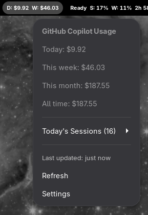

# Copilot Usage - GNOME Shell Extension

A GNOME Shell extension that shows a running total of your **GitHub Copilot CLI**
spend in the top bar: today's spend (since midnight) and this week's spend
(since Monday), both in dollars.

It works entirely from local data: there are no API calls and no credentials to
configure. The extension watches `~/.copilot/session-state/` for changes and
recomputes the totals whenever a session writes new data.



## Top bar display

```
D: $1.23  W: $8.40
```

- **D**: total spent today, since local midnight
- **W**: total spent this calendar week, since Monday 00:00

Click the indicator for a breakdown (today / this week / this month / all time)
and a list of today's sessions with their cost, message count, and tool calls.

## How it works

GitHub Copilot CLI writes an `events.jsonl` file per session to:

```
~/.copilot/session-state/<session-id>/events.jsonl
```

When a session closes it appends a `session.shutdown` event recording usage as
nano-AIU at `data.totalNanoAiu`, where `AIC = totalNanoAiu / 1e9`. The extension
sums that across sessions and converts AIC to dollars at **1 AIC = $0.01**
(configurable). Sessions before ~2026-06 predate nano-AIU tracking and are
excluded. (See `SUMMARY.md` for the full data-format notes.)

Because usage is only recorded on shutdown, sessions that are still open don't
contribute to the total until they exit.

The actual scanning is done by [`copilot-usage-cli`](copilot-usage-cli/) -- a
tiny dependency-free Node script. The extension bundles a copy and runs
`node copilot-usage.js --json` in a short-lived subprocess, so it never blocks
GNOME Shell; an mtime/size cache keeps repeat scans cheap. It sets up
`inotify`-backed file monitors on the session directory and each recently-active
session sub-directory so the totals update in near real time, with a periodic
rescan (default every 30s) backstopping anything the watcher misses.

## Requirements

- GNOME Shell 45-50
- Node.js >= 14 (the extension runs the bundled `copilot-usage.js` with `node`)
- GitHub Copilot CLI (writes the `~/.copilot/session-state` files)

## Installation

```bash
./install.sh
```

Then either log out and back in, or on X11 press Alt+F2, type `r`, Enter.

Enable it:

```bash
gnome-extensions enable copilot-usage@local
```

Open preferences (refresh interval, dollars-per-AIC):

```bash
gnome-extensions prefs copilot-usage@local
```

## Files

```
copilot-usage/
├── extension.js              # Main GNOME extension code
├── prefs.js                  # Preferences UI
├── metadata.json             # Extension metadata
├── stylesheet.css            # Panel/menu styles
├── schemas/                  # GSettings schema
│   └── org.gnome.shell.extensions.copilot-usage.gschema.xml
├── install.sh                # Installation script (bundles the CLI script)
├── copilot-usage-cli/        # Standalone npm package (the scanner)
│   ├── copilot-usage.js      # Single-file CLI: reads events.jsonl, prints JSON/text
│   ├── package.json
│   └── README.md
└── README.md
```

The scanner lives in `copilot-usage-cli/` and is also publishable to npm as
`copilot-usage-cli` for standalone terminal use. `install.sh` copies
`copilot-usage.js` into the installed extension directory.

## Quick check from the terminal

Run the CLI directly to see the JSON the extension consumes:

```bash
node copilot-usage-cli/copilot-usage.js --json     # or, if installed globally: copilot-usage --json
```

It also has human-readable output: `copilot-usage`, `copilot-usage sessions`,
`copilot-usage session <id>`.

## Troubleshooting

**Indicator shows `D: ERR`**: run the CLI manually (above) to see the error.
Make sure `node` is on `PATH` (the extension uses `/usr/bin/node` if present).

**Totals look low**: only *closed* sessions report a cost. A session you're
still running won't be counted until it exits.

**Logs:**

```bash
journalctl -f -o cat /usr/bin/gnome-shell | grep -i copilot
```

## Development

Test changes without logging out by running a nested GNOME Shell:

```bash
dbus-run-session gnome-shell --devkit --wayland
```

## License

MIT
